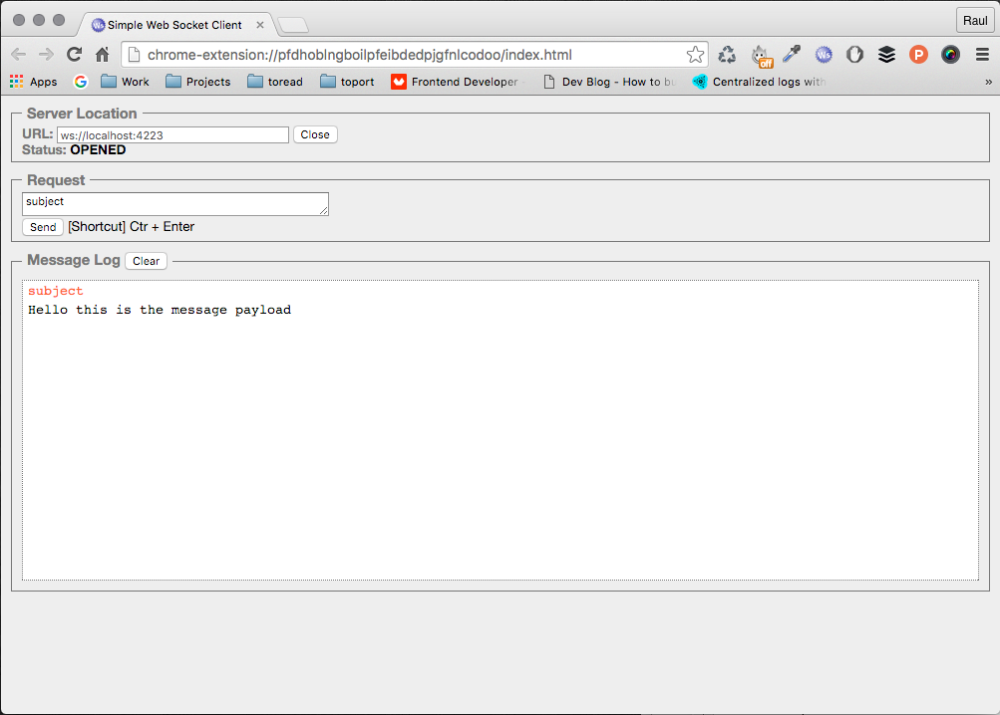

# wsgnatsd

A proxy client that adds websocket support to NATS

## Usage

```
$ wsgnatsd --help
Usage of wsgnatsd:
  -addr string
        Network host to listen on. (default "localhost")
  -port int
        Port to listen on. (default 4223)
  -version
        Print version information.
```

So starting a the proxy:

```
$ wsgnatsd --addr localhost --port 4223
2016/03/02 01:00:44 Starting wsgnatsd version 0.1.0
2016/03/02 01:00:44 Listening for client connections on localhost:4223
```

## Sending messages

```
$ curl -X POST --data "Hello this is the message payload!" http://localhost:4223/subject
```

## Listening for messages

Use whatever client websocket you want to use and connect to the server.
I'm using for my tests this one: https://github.com/hakobera/Simple-WebSocket-Client

Once you are connected the message you sent will be the subject to listen at.

Screenshot:


